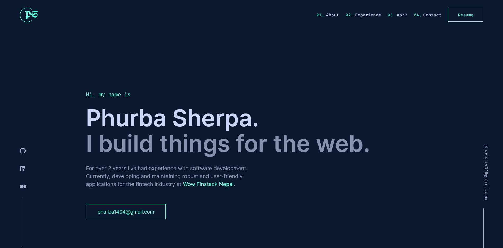

# Phurba Sherpa - personal website

Iterative version of my first portfolio. 

## Table of contents

- [Phurba Sherpa - a personal website](#Phurba-sherpa-a-personal-website)
  - [Table of contents](#table-of-contents)
  - [Overview](#overview)
    - [Screenshot](#screenshot)
    - [Links](#links)
  - [My process](#my-process)
    - [Built with](#built-with)
  - [Author](#author)

## Overview

### Screenshot

### Links

- Solution URL: [*VIEW CODE*](https://github.com/Phurba-Sherpa/v2-portfolio)
- Live Site URL: [*PREVIEW SITE*](https://v2.phurbasherpa.name.np/)

## My process

### Built with

- React
- Typescript
- BEM
- Styled components

## Author

- Website - [Phurba Sherpa](https://v2.phurba.sherpa.name.np)
- Frontend Mentor - [@Phurba-Sherpa](https://www.frontendmentor.io/profile/Phurba-Sherpa)
- Medium - [@phurba](https://medium.com/@phurba)
